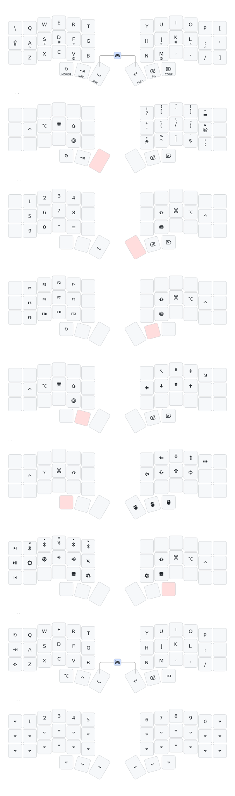

[](https://github.com/not-in-stock/zen-zmk-config/actions/workflows/build.yml)

# zen-zmk-config

Personal ZMK firmware configuration for Corne-style split keyboards. Inspired by [urob's timeless homerow mods](https://github.com/urob/zmk-config) and [Miryoku](https://github.com/manna-harbour/miryoku) layout principles.

**Compatible with 36 and 42 key layouts** — the outer pinky columns contain only secondary functions (Caps Lock, brackets, backslash), so 36-key boards work too.



## Features

### Timeless Homerow Mods

Traditional homerow mods suffer from accidental activations during fast typing. This config uses urob's "timeless" approach with aggressive `require-prior-idle-ms` settings:

```
tapping-term-ms = <5000>;        // effectively infinite
require-prior-idle-ms = <260>;   // key won't act as modifier unless idle
hold-trigger-on-release;         // wait until key release to decide
hold-trigger-key-positions = ... // only trigger from opposite hand
```

This means the modifier only activates when:
1. You paused typing for at least 260ms before pressing the key
2. The next keypress comes from the opposite hand

Result: virtually no misfires during normal typing, while still allowing comfortable modifier access.

### Miryoku-Inspired Layer Structure

**Homerow modifiers** (Ctrl-Alt-Cmd-Shift pattern):
- Left hand: `A`=Ctrl, `S`=Alt, `D`=Cmd, `F`=Shift
- Right hand: mirrored — `J`=Shift, `K`=Cmd, `L`=Alt, `;`=Ctrl

**Thumb keys** use layer-tap for one-shot layer access:
| Key | Tap | Hold |
|-----|-----|------|
| Left outer | Esc | Mouse |
| Left middle | Tab | Nav |
| Left inner | Space | Symbols |
| Right inner | Return | Numbers |
| Right middle | Backspace | Fn |
| Right outer | Delete | Config |

**Mirrored modifiers on every layer** — each layer has the same modifier positions, so you can combine modifiers with layer actions using only one hand.

### Layers

| Layer | Purpose |
|-------|---------|
| **BASE** | QWERTY with homerow mods |
| **SYM** | Symbols with shift-morphing (one key = two symbols) |
| **NUM** | Numbers 1-9, 0 on the left side |
| **FN** | Function keys F1-F12 |
| **NAV** | Arrow keys, Home/End, Page Up/Down |
| **MOUSE** | Mouse emulation (movement + scroll + clicks) |
| **CONF** | Bluetooth, media controls, brightness, system reset |
| **GAME** | Gaming mode without homerow mods |

### Shift-Morphing Symbols

The SYM layer uses `mod-morph` to pack two symbols per key. Tap for primary, Shift+tap for secondary:

| Tap | Shifted |
|-----|---------|
| `?` | `!` |
| `[` | `{` |
| `'` | `"` |
| `]` | `}` |
| `-` | `+` |
| `(` | `<` |
| `/` | `\` |
| `)` | `>` |
| `#` | `*` |
| `^` | `%` |
| `\|` | `_` |
| `$` | `` ` `` |
| `=` | `~` |
| `@` | `&` |
| `:` | `;` |

### macOS Globe Key

The `V` and `M` keys have Globe (🌐) on hold for quick access to macOS features like Emoji picker, Dictation, etc.

### Gaming Mode

Press both inner thumb keys simultaneously to toggle gaming mode. This layer disables homerow mods for uninterrupted WASD gameplay. Same combo switches back to normal mode.

### Bluetooth Controls

The CONF layer provides Bluetooth profile selection (0-4). Hold Shift while selecting a profile to clear its pairing — no separate "clear" keys needed.

## Building

### Local builds with Nix (recommended)

A [`flake.nix`](./flake.nix) provides a reproducible build environment and
firmware packages via [`zmk-nix`](https://github.com/lilyinstarlight/zmk-nix).
Works on `x86_64-linux`, `aarch64-linux`, `x86_64-darwin` and `aarch64-darwin`.

Two aggregate outputs bundle the firmwares for each supported topology:

```sh
nix build .#wireless   # classic wireless Corne: central left + peripheral right
nix build .#dongle     # wired USB dongle + two peripheral halves
```

Or via the `justfile` (from inside `nix develop`, or with `just` installed):

```sh
just wireless   # → build/wireless/*.uf2
just dongle     # → build/dongle/*.uf2
just all        # build both
just clean      # remove build/ and stray result symlinks
```

The resulting directory contains the relevant `.uf2` files named per role
(e.g. `corne_central_left.uf2`, `corne_right.uf2`).

Individual firmwares are also exposed:

```sh
nix build .#corne_dongle       # → result/zmk.uf2
nix build .#corne_central_left
nix build .#corne_left
nix build .#corne_right
```

Flash the current `result/` to a connected bootloader:

```sh
nix run .#flash
```

Enter a dev shell (west, cmake, ninja, `arm-none-eabi-gcc`) for manual
`west build` invocations:

```sh
nix develop
```

After bumping revisions in `config/west.yml`, update the fixed-output hash of
the prefetched west dependencies:

```sh
nix run .#update
```

then copy the new `sha256-…` into `zephyrDepsHash` in `flake.nix`.

**Note:** the flake patches `prospector-zmk-module`'s `display_idle.c` at build
time to fix a `SYS_INIT` callback signature that is incompatible with current
Zephyr. Once upstream `feat/add-display-sleep` is updated, that `postConfigure`
hook can be removed from `flake.nix`.

### GitHub Actions

Firmware is also built automatically via GitHub Actions. Download the latest
artifacts from the [Actions tab](https://github.com/not-in-stock/zen-zmk-config/actions).

## Credits

- [urob/zmk-config](https://github.com/urob/zmk-config) — timeless homerow mods concept and helper macros
- [urob/zmk-helpers](https://github.com/urob/zmk-helpers) — ZMK convenience macros
- [Miryoku](https://github.com/manna-harbour/miryoku) — layer structure inspiration
- [keymap-drawer](https://github.com/caksoylar/keymap-drawer) — keymap visualization
